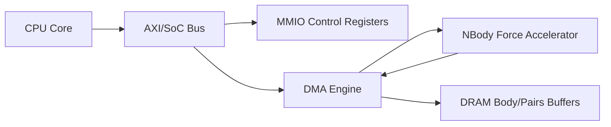

# Hardware Acceleration Proposal

## 1) nbody Pairwise Force Accelerator

### HDL implementation
- File: `nbody_accel.sv`
- Function: computes inverse-distance scaled force terms for one body pair per valid transaction.

### I/O specification
- Clock/reset: `clk`, `rst_n`
- Handshake: `in_valid`, `in_ready`, `out_valid`, `out_ready`
- Inputs:
  - `dx`, `dy`, `dz`: signed 32-bit fixed-point deltas (Q16.16)
  - `mass_j`: unsigned 32-bit fixed-point mass (Q16.16)
- Outputs:
  - `fx`, `fy`, `fz`: signed 32-bit fixed-point force contributions (Q16.16)

### Architecture description
- Pipeline stages:
  1) compute squared distance + softening
  2) reciprocal square-root approximation
  3) multiply by mass and deltas to emit force vector
- Internal registers isolate each stage for 1-sample/cycle throughput after fill.

### HW/SW interface
- Memory-mapped command registers:
  - base addresses for body arrays
  - pair count
  - start/done flags
- DMA streams body pairs to accelerator and writes force accumulations back.

### Justification
- nbody hotspot is arithmetic-dense and highly parallel.
- Fixed-point pipeline enables high throughput with predictable latency.
- Expected speedup: substantial for force kernel, limited by host update/merge overhead.

### Block diagram

### Trade-offs
- Wider datapath improves precision and throughput but increases area/power.
- More pipeline stages increase max frequency but add control complexity.

## 2) mdp Transition Score Accelerator

### HDL implementation
- File: `mdp_transition_accel.sv`
- Function: parallel multiply-accumulate of transition probabilities and value terms.

### I/O specification
- Clock/reset: `clk`, `rst_n`
- Handshake: `in_valid`, `in_ready`, `out_valid`, `out_ready`
- Inputs:
  - `prob`: unsigned 16-bit fixed-point probability (Q0.16)
  - `reward`: signed 32-bit fixed-point reward (Q16.16)
  - `value_next`: signed 32-bit fixed-point next-state value (Q16.16)
  - `gamma`: unsigned 16-bit discount factor (Q0.16)
- Output:
  - `score`: signed 32-bit fixed-point expected score (Q16.16)

### Architecture description
- Computes `score = prob * (reward + gamma * value_next)`.
- Pipeline stages:
  1) discount multiply
  2) reward add
  3) probability multiply and saturation

### HW/SW interface
- CPU keeps branch logic and state expansion in software.
- Offloads only transition score kernel via MMIO or batched DMA descriptor queue.

### Justification
- MDP has mixed control and arithmetic behavior.
- Arithmetic kernel repeats heavily and is amenable to hardware offload.
- Expected speedup: moderate overall, high for value update subroutine.

### Block diagram

### Trade-offs
- Aggressive parallel lanes increase throughput and memory bandwidth pressure.
- Fixed-point arithmetic reduces area but may add approximation error.
