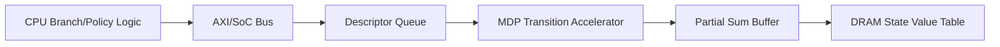

# Hardware Acceleration Proposal

## 1) nbody Pairwise Force Accelerator

### HDL implementation
- Final design: `subNbody/hardware/nbody_accel_v2.sv`
- Preliminary design retained for review history: `subNbody/hardware/nbody_accel_original.sv`
- Function: computes true inverse-cube velocity deltas for both bodies in one pair transaction.

The preliminary accelerator is not the final hardware design. It omitted `dt` and `mass_i`, returned only one vector, did not pipeline valid/data together, and computed a scaled `1/d2` rather than the required $1/r^3$.

### I/O specification
- Clock/reset: `clk`, `rst_n`
- Handshake: `in_valid`, `in_ready`, `out_valid`, `out_ready`
- Inputs:
  - `dx`, `dy`, `dz`: signed 32-bit fixed-point deltas (Q16.16)
  - `mass_i`, `mass_j`: unsigned 32-bit fixed-point masses (Q16.16)
  - `dt`: unsigned 32-bit fixed-point timestep (Q16.16)
- Outputs:
  - `dvix`, `dviy`, `dviz`: signed Q16.16 velocity deltas for body i
  - `dvjx`, `dvjy`, `dvjz`: signed Q16.16 velocity deltas for body j

### Architecture description
- Five-stage fixed-point pipeline:
  1. Compute Q32.32 `d2 = dx*dx + dy*dy + dz*dz` in 64 bits.
  2. Compute integer square root and the 96-bit Q48.48 `d2*sqrt(d2)` denominator.
  3. Compute saturated Q16.16 $1/r^3$ as `2^64 / denominator_raw`.
  4. Compute separate Q48 scales using `dt*mass_j` for body i and `dt*mass_i` for body j.
  5. Compute six signed velocity deltas, then symmetrically round and saturate to Q16.16.
- Per-stage valid registers and delayed operands keep every transaction aligned.
- Global backpressure freezes all valid and payload registers together.

### Functional verification

- ModelSim compilation completed with `0` errors and `0` warnings.
- Comprehensive testbench verdict: `NBODY_ACCEL_TEST=PASS transfers=12 latency=5 throughput=1/cycle`.
- Tested behavior includes reset, input gaps, back-to-back requests, output ordering, backpressure, fixed-point tolerance, zero distance, and signed saturation.
- Five-clock latency and one-transaction-per-cycle throughput are simulation observations, not post-synthesis timing results.

### Proposed HW/SW interface

The interface below was not implemented. A future native driver/API could batch the 10 body pairs per timestep into DMA records:

```text
Python Nbody -> driver/API -> MMIO/FIFO/DMA -> nbody_accel_v2
             <- velocity deltas for both bodies <-
```

Each input record would carry `dx`, `dy`, `dz`, `mass_i`, `mass_j`, and `dt`. Each output record would return `dvix`, `dviy`, `dviz`, `dvjx`, `dvjy`, and `dvjz`. Software would merge all 10 pair contributions in the original order before updating positions.

### Evidence boundary

- The measured application result is the pure-Python V1 scalarization result: `4.881335 s` to `4.381726 s`, or `1.1140x` and `10.24%` improvement.
- The RTL was functionally verified only in simulation.
- The accelerator was not connected to Python and was not synthesized for an FPGA or ASIC.
- No end-to-end hardware runtime, hardware speedup, area, frequency, or power was measured.
- Any future hardware performance projection must be labeled as an estimate based on explicit assumptions.

### Block diagram


### Trade-offs
- Wider fixed-point intermediates preserve precision but increase arithmetic and register cost.
- The combinational square root and variable divider are likely timing and area risks after synthesis.
- Sharing arithmetic could reduce area and power but would reduce throughput.
- No quantitative area or power claim is possible without synthesis and target-specific analysis.

## 2) mdp Transition Score Accelerator

### HDL implementation
- File: `mdp_transition_accel.sv`
- Function: parallel multiply-accumulate of transition probabilities and value terms.

### I/O specification
- Clock/reset: `clk`, `rst_n`
- Handshake: `in_valid`, `in_ready`, `out_valid`, `out_ready`
- Inputs:
  - `prob`: unsigned 16-bit fixed-point probability (Q0.16)
  - `reward`: signed 32-bit fixed-point reward (Q16.16)
  - `value_next`: signed 32-bit fixed-point next-state value (Q16.16)
  - `gamma`: unsigned 16-bit discount factor (Q0.16)
- Output:
  - `score`: signed 32-bit fixed-point expected score (Q16.16)

### Architecture description
- Computes `score = prob * (reward + gamma * value_next)`.
- Pipeline stages:
  1) discount multiply
  2) reward add
  3) probability multiply and saturation

### HW/SW interface
- CPU keeps branch logic and state expansion in software.
- Offloads only transition score kernel via MMIO or batched DMA descriptor queue.

### Justification
- MDP has mixed control and arithmetic behavior.
- Arithmetic kernel repeats heavily and is amenable to hardware offload.
- Expected speedup: moderate overall, high for value update subroutine.

### Block diagram


### Trade-offs
- Aggressive parallel lanes increase throughput and memory bandwidth pressure.
- Fixed-point arithmetic reduces area but may add approximation error.
