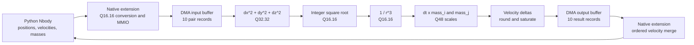

# Nbody Hardware/Software Optimization Project Log

## Purpose
This document is the single source of truth for the Nbody workstream from this point forward. It records what was executed, why each action was taken, what changed, technical interpretation of results, and decisions for both software and hardware acceleration.

This log is intentionally explanatory rather than a raw terminal dump so it can be reused directly for presentation preparation.

## Scope Rules
- Benchmark code is not modified in this step.
- Every important step must append:
  - command(s)
  - reason
  - changed files
  - technical meaning of outcomes
- Keep conclusions evidence-based and tie claims to measured data.

## Current Status
### Completed
- Created this tracking file.
- Defined end-to-end execution plan from current state to final submission.
- Preserved benchmark code unchanged for now.
- Inspected original Nbody source file in VM and documented algorithm details.
- Created V1 scalarized benchmark copy without modifying original source.
- Created and executed a short VM correctness test for V1.
- Created V2 unrolled benchmark copy from V1 and verified correctness in VM.
- Created V3 sqrt-form benchmark copy from V2 and verified correctness in VM.
- Created V4 invariant-precompute benchmark copy from V3 and verified correctness in VM.
- Created an experimental combined pure-Python benchmark (`run_benchmark_optimized.py`) containing the V1-V4 transformations.
- Ran a complete VM correctness comparison of the combined experiment against the original for final positions, velocities, and energy.
- Benchmarked the original, V1, V2, V3, V4, and final combined implementations under the same `python3-dbg`/pyperformance environment.
- Identified V1 scalarization as the best measured implementation: original `4.881335 s`, V1 `4.381726 s`, `1.1140x`, and `10.24%` improvement.
- Profiled only the original and best measured V1 implementation at 499 Hz and generated separate perf reports and flamegraphs.
- Reviewed the preliminary original accelerator, now stored as `subNbody/hardware/nbody_accel_original.sv`, against the required Nbody equations, Q16.16 interface, and ready/valid behavior without modifying it.
- Implemented and behaviorally validated the corrected `subNbody/hardware/nbody_accel_v2.sv` while preserving the original accelerator.

### Remaining
- Synthesize `nbody_accel_v2.sv` for a specified target if physical area, timing, or power results are required.
- Implement a driver and MMIO/FIFO/DMA wrapper if end-to-end hardware acceleration is required.
- Measure the complete Python-to-hardware path before claiming hardware speedup.
- Commit and publish the final consolidated project when ready.

## Historical Execution Plan

This plan records how the completed work was approached. It is not a list of current recommendations, and its provisional V5 label refers to the combined experiment that was later measured and rejected in favor of V1.
1. Stabilize measurement setup
- Goal: reduce noise and make comparison defensible.
- Actions: pin environment, avoid background load, optionally use pyperf tuning guidance.

2. Establish reproducible baselines
- Goal: ensure baseline JSON and perf artifacts are valid and traceable.
- Actions: verify existing nbody artifacts and complete missing mdp artifacts.

3. Build optimization ladder (Nbody)
- Goal: isolate contribution of each change.
- Versions:
  - V0 original
  - V1 scalar local variables
  - V2 unrolled fixed body pairs
  - V3 sqrt-based inverse-distance expression
  - V4 precomputed dt*mass constants
  - Combined V1-V4 experimental path (provisionally called V5 during planning)

4. Correctness gate before expensive benchmarking
- Goal: prevent invalid speedups caused by numerical or logic drift.
- Actions: compare physical invariants/outputs within tolerance, confirm no NaN/Inf, verify deterministic behavior under repeated short runs.

5. Full performance evaluation
- Goal: collect statistically meaningful performance evidence.
- Actions: run pyperformance for baseline and optimized variants, compare outputs, interpret significance.

6. Profiling analysis and flamegraph narrative
- Goal: explain where time moved and why.
- Actions: capture perf for optimized run(s), generate flamegraphs, compare before vs after hotspot widths and call-path composition.

7. Hardware acceleration refinement
- Goal: align hardware proposal with true Nbody math and cycle-accurate flow.
- Actions: confirm 1/r^3 datapath, stage alignment with valid propagation, I/O contract, software interface, expected frequency and trade-offs.

8. Final packaging
- Goal: ensure submission quality.
- Actions: synchronize report text with measured results, ensure scripts are reproducible, finalize README and presentation notes.

## Original Nbody Benchmark

Source inspected:
- /opt/pyperformance/pyperformance/data-files/benchmarks/bm_nbody/run_benchmark.py

### Body representation

Each body is represented as a 3-tuple:

```python
([x, y, z], [vx, vy, vz], mass)
```

- Position is a mutable list of 3 floats.
- Velocity is a mutable list of 3 floats.
- Mass is a scalar float.

All five bodies are stored in `BODIES` and then flattened to:

```python
SYSTEM = list(BODIES.values())
```

### The 10 body pairs

The benchmark precomputes unique unordered body pairs once:

```python
PAIRS = combinations(SYSTEM)
```

With 5 bodies, pair count is:

$$
\binom{5}{2} = 10
$$

The 10 interactions are conceptually:

- 0-1, 0-2, 0-3, 0-4
- 1-2, 1-3, 1-4
- 2-3, 2-4
- 3-4

This avoids duplicate pair computation and avoids self-interactions.

### `advance(dt, n, bodies=SYSTEM, pairs=PAIRS)`

This is the simulation hot path. For each of `n` timesteps:

1. Iterate all body pairs.
2. Compute displacement vector:

```python
dx = x1 - x2
dy = y1 - y2
dz = z1 - z2
```

3. Compute force scale factor:

```python
mag = dt * ((dx*dx + dy*dy + dz*dz) ** (-1.5))
```

Equivalent formula:

$$
	ext{mag} = dt \cdot \frac{1}{(r^2)^{3/2}} = dt \cdot \frac{1}{r^3}
$$

where:

$$
r^2 = dx^2 + dy^2 + dz^2
$$

4. Scale by masses and update velocities for both bodies (equal and opposite effect):

```python
b1m = m1 * mag
b2m = m2 * mag
v1[0] -= dx * b2m
...
v2[0] += dx * b1m
...
```

5. After all pair forces are applied, update each body position:

```python
r[0] += dt * vx
r[1] += dt * vy
r[2] += dt * vz
```

### `report_energy(bodies=SYSTEM, pairs=PAIRS, e=0.0)`

Computes total system energy as potential + kinetic.

Potential term over pairs:

```python
e -= (m1 * m2) / sqrt(dx*dx + dy*dy + dz*dz)
```

Kinetic term over bodies:

```python
e += m * (vx*vx + vy*vy + vz*vz) / 2.0
```

Mathematically:

$$
E = \sum_i \frac{1}{2}m_i\|v_i\|^2 - \sum_{i<j}\frac{m_i m_j}{r_{ij}}
$$

The benchmark calls this before and after `advance()` to validate physical consistency and prevent dead-code elimination.

### `offset_momentum(ref, bodies=SYSTEM, px=0.0, py=0.0, pz=0.0)`

Computes total momentum of all bodies and adjusts one reference body (default sun) so net momentum becomes zero.

Core logic:

```python
px -= vx * m
py -= vy * m
pz -= vz * m
v_ref[0] = px / m_ref
v_ref[1] = py / m_ref
v_ref[2] = pz / m_ref
```

This establishes a centered inertial frame and prevents artificial drift in long simulations.

### Operations inside the hot loop

Inside the pairwise inner loop, the expensive repeated operations are:

- Float subtract/multiply/add for `dx, dy, dz, d2`.
- Power operation `** (-1.5)`.
- Per-pair list index reads and writes to velocity vectors.
- Mass scaling multiplications (`m1 * mag`, `m2 * mag`).

These operations map directly to profiling hotspots such as Python arithmetic dispatch and float/list object handling.

### Invariant values (important for optimization)

Values that do not change during one `advance()` call:

- `dt`
- Masses (`m1`, `m2`, ...)
- Pair topology (`PAIRS` contents/order)
- Body count (always 5 in this benchmark setup)

Values that do change each iteration:

- Positions `[x, y, z]`
- Velocities `[vx, vy, vz]`
- Pairwise distances and force magnitudes

Optimization implication:

- Good candidates for precomputation are terms involving only constants/invariants.
- Hot-loop savings are most likely from reducing Python indexing/object churn and expensive scalar ops.

## Historical RTL Review: Preliminary Original Accelerator

### Scope and mathematical reference

This is a review of the accelerator RTL created for this project, not RTL taken from the pyperformance benchmark. The benchmark supplies the mathematical behavior that the proposed accelerator must reproduce. The review uses the tracked `subNbody/hardware/nbody_accel_original.sv` version. The accidentally removed working-tree file was restored unchanged after the review; no RTL corrections were applied.

The required pair update is:

$$
d2 = dx^2 + dy^2 + dz^2
$$

$$
inv\_r3 = \frac{1}{d2\sqrt{d2}}
$$

$$
scale_i = dt \cdot mass_j \cdot inv\_r3
$$

$$
scale_j = dt \cdot mass_i \cdot inv\_r3
$$

$$
d\vec{v_i} = -\Delta\vec{r}\cdot scale_i,
\qquad
d\vec{v_j} = +\Delta\vec{r}\cdot scale_j
$$

The hardware proposal defines `dx`, `dy`, and `dz` as signed Q16.16, `mass_j` as unsigned Q16.16, and `fx`, `fy`, and `fz` as signed Q16.16.

### Overall verdict

The current RTL is not mathematically or transactionally correct for the required Nbody pair update. It cannot be repaired by changing only a constant or output shift. The datapath needs explicitly aligned operands and valid state, a real square-root/inverse-cube implementation, both masses and `dt`, defined wide intermediate formats, and an overflow policy. No corrected RTL is generated in this review.

### Critical: nonblocking dependencies and stale registers

All datapath assignments are in one `always_ff` block and use nonblocking assignments. Every right-hand side therefore reads the value from before the active clock edge:

- `inv_r3 <= ... / d2` uses an old `d2`, not the distance captured on the same edge.
- `scale <= inv_r3 * mass_j` uses an older `inv_r3` but the current, unstaged `mass_j` input.
- `fx`, `fy`, and `fz` use an older `scale` but the current, unstaged deltas.

After several accepted transactions, an output can combine the current delta, a prior transaction's mass, and an inverse term derived from an even earlier transaction's distance. Related operands are not delayed together, so this is not a valid arithmetic pipeline.

`d2`, `inv_r3`, and `scale` are also not reset. The first accepted input divides by an unknown old `d2` and multiplies by unknown intermediate values, producing `X` outputs in simulation. Resetting them to zero alone would merely replace unknowns with divide-by-zero and stale-zero behavior; it would not fix transaction alignment.

The internal registers advance only when `in_valid && in_ready` is true. An input bubble does not advance a partially computed transaction toward the output. The block is therefore neither a coherent single-cycle transform nor a functioning multistage pipeline.

### Critical: valid/data alignment

`out_valid` is asserted for the newly accepted input on the same edge that captures its `d2`, but the output payload uses stale `scale`. The valid bit therefore labels data from mismatched transactions.

There are no valid bits for the distance, inverse, or scale stages and no stage-aligned copies of `dx`, `dy`, `dz`, masses, or `dt`. A correct multicycle implementation must carry each transaction's operands and valid token through every stage. If a stage stalls, its data and valid state must stall together.

### Valid/ready handshake

The expression `in_ready = out_ready | ~out_valid` is a valid one-entry output-register pattern in isolation:

- With `out_valid && !out_ready`, `in_ready` is low and output data remains stable.
- An output can be consumed and replaced by a new input on the same edge.
- An empty output slot can accept a new input.

However, this ready signal tracks only the output register. It does not track occupancy or backpressure for the claimed distance, inverse, and multiply stages. Since there are no per-stage valid/ready registers, the module asserts `out_valid` before the accepted transaction's arithmetic is complete. The handshake shell has a useful backpressure property, but it is connected to an invalid datapath schedule.

### Critical: `1/r^3` is not implemented

The RTL calculates:

```systemverilog
inv_r3 <= (64'sd1 <<< 40) / d2;
```

This is a scaled reciprocal of `d2`, proportional to $1/d2 = 1/r^2$. There is no square-root calculation, so the RTL does not compute:

$$
\frac{1}{d2\sqrt{d2}} = \frac{1}{r^3}
$$

The proposal describes a reciprocal-square-root approximation stage, but no such stage exists. The register name `inv_r3` is misleading because its implemented value is a scaled `inv_d2`.

The RTL also adds raw `65536` to `d2`. For Q32.32 squared distance, this represents $2^{-16}$, not `1.0`. It is an undocumented softening term that changes the required equation. If softening is intended, its units and matching software behavior must be specified. If it is removed, coincident positions need an explicit divide-by-zero policy.

### Critical: force equations and interface are incomplete

The module has no `dt` input, so it cannot compute either required scale. It has `mass_j` but no `mass_i`, and it emits only one output vector. It cannot produce both equal-and-opposite body updates.

For the specified delta convention, body i requires a negative update. The current outputs calculate `+delta * scale`, so they have the wrong sign for body i. They also cannot represent body j's update because that path needs `mass_i` and a separate positive output vector. The existing interface therefore represents neither complete required update.

### Signed arithmetic and distance range

The deltas are signed, but their squares and sum are nonnegative. Declaring `d2` signed is unsafe. A signed 32-bit raw delta can have a square as large as $2^{62}$; three such terms can approach $3\cdot2^{62}$, exceeding signed 64-bit maximum $2^{63}-1$. `d2` can wrap negative even though squared distance cannot be negative.

The combined square-and-sum expression also relies on SystemVerilog context sizing. Explicit widened products and an explicitly sized unsigned accumulator are required to prove that no product or partial sum is truncated. A negative or truncated `d2` corrupts division and all downstream signs.

`mass_j` is converted with `$signed({1'b0, mass_j})`. The leading zero preserves its nonnegative value in a 33-bit signed representation, but it does not solve product width, scaling, or range problems.

### Multiplication widths and overflow

The full mathematical products are wider than the declared destinations:

- A 64-bit inverse multiplied by the 33-bit signed mass representation can require 97 bits, but `scale` is only 64 bits.
- A signed 32-bit delta multiplied by a signed 64-bit scale can require 96 bits before rescaling, but there is no explicit 96-bit product.
- The shifted product is assigned directly to a signed 32-bit output.

Multiplication and shift sizing is context-sensitive in SystemVerilog. Without explicit wide intermediates, the source cannot prove that the intended bits survive before `>>> 24`. In all cases, narrowing into 64- and 32-bit registers can silently discard significant bits.

There is no overflow detection, saturation, range assertion, or rounding. Out-of-range values wrap. The arithmetic right shift discards fractional bits and does not provide round-to-nearest, which can bias fixed-point results.

### Fixed-point scaling

With Q16.16 deltas:

- A squared delta and `d2` use Q32.32 scaling.
- `sqrt(d2)` naturally corresponds to Q16.16 when integer-square-root scaling is handled correctly.
- `d2 * sqrt(d2)` requires a wide Q48.48 denominator before reciprocal normalization.

The current constants imply an undocumented format for the incorrect reciprocal-of-`d2` path. Dividing $2^{40}$ by a Q32.32 `d2` yields approximately eight fractional bits in the reciprocal. Combining that with Q16.16 mass and Q16.16 delta yields roughly 40 fractional bits before `>>> 24` returns a nominal Q16.16 output. This explains the constants `40` and `24`, but gives low reciprocal precision and is not stated in the interface contract.

That scaling does not apply to the required inverse cube. A Q48.48 `d2*sqrt(d2)` denominator needs a newly derived reciprocal normalization and wider storage. Adding Q16.16 `dt` also introduces another 16 fractional bits that the current final shift does not account for.

No bounds are documented for deltas, masses, `dt`, minimum distance, inverse value, scale, or output velocity increment. Width sufficiency and numerical error therefore cannot be proven.

### Synthesis and verification gaps

Variable 64-bit division with `/` implies a large combinational divider unless a synthesis tool replaces or rejects it. The proposal claims a pipelined reciprocal-square-root approximation and one-sample-per-cycle throughput, but the RTL contains neither a square-root unit nor a divider latency protocol. Timing and throughput claims are unsupported.

No RTL testbench, assertions, or software-reference vector comparison was found. A future implementation needs tests for reset, back-to-back distinct transactions, input bubbles, output backpressure, simultaneous consume/accept, negative deltas, maximum magnitudes, zero/near-zero distance policy, and fixed-point error against the software equations.

### Review conclusion

The reusable part is limited to the module shell and the one-entry output backpressure pattern. The arithmetic datapath and its control do not implement the required Nbody update. Corrected RTL should wait until the interface is finalized for `dt`, both masses, both output vectors, softening policy, numeric ranges, fixed-point formats, pipeline latency, and throughput/backpressure behavior.

## Corrected RTL: `subNbody/hardware/nbody_accel_v2.sv`

### Interface and numeric contract

The corrected accelerator keeps the original `subNbody/hardware/nbody_accel_original.sv` and adds a separate implementation at `subNbody/hardware/nbody_accel_v2.sv`.

All position deltas and velocity-increment outputs are signed Q16.16. `mass_i`, `mass_j`, and `dt` are nonnegative unsigned Q16.16 values. One accepted transaction describes one body pair and produces both equal-and-opposite velocity updates.

The module ports are:

- Control: `clk`, active-low `rst_n`, `in_valid`, `in_ready`, `out_valid`, and `out_ready`.
- Inputs: signed `dx`, `dy`, `dz`; unsigned `mass_i`, `mass_j`, and `dt`.
- Body-i outputs: signed `dvix`, `dviy`, and `dviz`.
- Body-j outputs: signed `dvjx`, `dvjy`, and `dvjz`.

No `real`, `shortreal`, or simulation-only square-root operation is used in the DUT.

### Five-stage datapath

Every stage has a corresponding valid register, and all operands needed by later stages are delayed with the same transaction.

1. **Distance stage:** squares signed Q16.16 deltas into unsigned Q32.32 values and accumulates them in unsigned 64-bit `d2`.
2. **Square-root/denominator stage:** a fixed-iteration, synthesizable restoring integer square root computes `floor(sqrt(d2_raw))`, representing Q16.16 distance. The stage multiplies this by `d2_raw` to form a 96-bit Q48.48 denominator.
3. **Inverse-cube stage:** unsigned integer division computes a saturated Q16.16 inverse cube from `2^64 / denominator_raw`.
4. **Scale stage:** two explicit 96-bit Q48 products compute `dt * mass_j * inv_r3` for body i and `dt * mass_i * inv_r3` for body j.
5. **Velocity-update stage:** explicit signed 129-bit products apply the negative sign for body i and positive sign for body j, round from Q64 to Q16.16, and saturate to the signed 32-bit output range.

The cross-mass selection is intentional: body i uses `mass_j`, while body j uses `mass_i`.

### Fixed-point derivation

For Q16.16 input deltas:

$$
d2_{raw} = d2\cdot2^{32}
$$

The integer square root has Q16.16 scaling:

$$
r_{raw} \approx \sqrt{d2}\cdot2^{16}
$$

Therefore:

$$
denominator_{raw} = d2_{raw}\cdot r_{raw}
\approx d2\sqrt{d2}\cdot2^{48}
$$

To obtain Q16.16 `inv_r3`, the required raw quotient is:

$$
inv\_r3_{raw}
= \frac{2^{16}}{d2\sqrt{d2}}
= \frac{2^{64}}{denominator_{raw}}
$$

The scale product contains three Q16.16 factors, so it is Q48. Multiplying by a Q16.16 delta produces Q64. The final stage shifts by 48 fractional bits to return Q16.16 outputs.

### Range and exceptional-value policy

- The three squared 32-bit deltas fit in one unsigned 64-bit sum; signed distance overflow is avoided.
- The Q48.48 denominator uses all 96 product bits.
- Scale products retain all 96 bits, and delta-scale products use explicit signed 129-bit operands and results.
- Final outputs use symmetric round-to-nearest with ties away from zero, followed by signed 32-bit saturation instead of wraparound.
- If `d2` is zero, the inverse stage saturates `inv_r3` to unsigned Q16.16 maximum. Since all deltas are then zero, both velocity-update vectors remain zero. Very small denominators whose reciprocal exceeds Q16.16 range also saturate.
- The integer square root rounds distance downward. The inverse cube is therefore a fixed-point approximation with Q16.16 output precision, not an exact real-number result.

### Valid/ready behavior

The pipeline is globally stallable. `in_ready` is high when the final stage is empty or the consumer asserts `out_ready`. Under output backpressure, all valid bits and all payload registers freeze together, so `out_valid` and every output remain stable.

When unstalled, the pipeline accepts one transaction per cycle and has five registered stages. Back-to-back inputs preserve order. A consumed final output can be replaced on the same edge, avoiding an extra output bubble.

The integer square-root loop and variable-width divider are synthesizable combinational logic between registers. They prioritize mathematical clarity and correctness; a production frequency/area optimization would replace them with iterative or vendor-specific pipelined units while preserving the same stage protocol and Q-format contract.

### RTL validation

A comprehensive self-checking testbench was added at `subNbody/hardware/tb_nbody_accel.sv`. It maintains an ordered transaction scoreboard and calculates expected velocity updates independently with real-number Nbody mathematics in the testbench only. The DUT remains entirely integer/fixed-point and synthesizable.

Simulation command:

```powershell
vlib.exe work
vlog.exe -sv subNbody\hardware\nbody_accel_v2.sv subNbody\hardware\tb_nbody_accel.sv
vsim.exe -c -do "run -all; quit -f" work.tb_nbody_accel
```

Validated cases:

- Active-low reset clears `out_valid` and all six output registers, followed by an `in_ready` check after reset release.
- A single exact unit-distance request checks the full equations and pipeline latency.
- Input gaps verify that bubbles do not create spurious outputs or misalign payloads.
- Four consecutive requests use positive and negative deltas on all axes, different masses, different `dt` values, and several distances.
- A scoreboard verifies output order and valid/data alignment for every visible output.
- Consecutive transaction groups verify sustained one-result-per-cycle throughput after pipeline fill.
- Three queued requests are held under `out_ready=0` for three cycles. The test checks persistent `out_valid`, deasserted `in_ready`, and bit-for-bit stable outputs.
- Exact vectors use zero-LSB tolerance. Non-axis-aligned fixed-point vectors use tolerances of 3 or 16 Q16.16 LSBs against the ideal real-valued equations to account for integer-square-root and reciprocal quantization.
- Zero distance verifies the documented finite policy: saturated internal inverse with zero velocity updates because every delta is zero.
- Large `dt` and mass values verify positive and negative signed-output saturation rather than wraparound.
- The final scoreboard count proves that all 12 accepted transactions produced exactly 12 ordered outputs.

Latency and throughput:

- The datapath has five registered stages.
- An input accepted on rising edge $N$ is transferred at the output handshake on edge $N+5$ when unstalled.
- `out_valid` and its payload become visible after the fifth pipeline stage, before that transfer edge.
- Once full and unstalled, the pipeline accepts and transfers one transaction per clock cycle.
- Backpressure adds stall cycles without changing transaction order or payload data.

Bugs found during comprehensive test development:

- No RTL bug was found by the expanded suite.
- The first testbench version advanced its scoreboard at a negative edge before the actual positive-edge ready/valid transfer. Changing `out_ready` around that edge caused expected and actual transactions to diverge. The scoreboard was corrected to consume entries only on `out_valid && out_ready` at the rising edge.
- The first final-count assertion expected 13 outputs although the stimulus issued 12 requests. The assertion was corrected to 12.
- After these testbench fixes, the same DUT passed all arithmetic, latency, throughput, alignment, backpressure, tolerance, zero-distance, and saturation checks.

ModelSim Intel FPGA Edition 10.5b results:

- DUT and testbench compilation: `0` errors, `0` warnings.
- Simulation verdict: `NBODY_ACCEL_TEST=PASS transfers=12 latency=5 throughput=1/cycle`.

Final architecture:

- Stage 1: signed Q16.16 delta capture and unsigned 64-bit Q32.32 squared-distance accumulation.
- Stage 2: synthesizable integer square root and 96-bit Q48.48 `d2*sqrt(d2)` denominator.
- Stage 3: Q16.16 inverse cube from `2^64 / denominator_raw`, with saturation for zero or very small denominators.
- Stage 4: separate 96-bit Q48 `scale_i` and `scale_j` products with correct cross-mass selection.
- Stage 5: signed 129-bit delta-scale products, opposite body signs, symmetric rounding, and signed Q16.16 saturation.
- One valid bit per stage and a global stall enable keep all valid and payload registers aligned under backpressure.

## Hardware Acceleration Proposal and Verification

The software and hardware results have different verification boundaries:

- The pure-Python software variants were actually executed with `python3-dbg`, checked against the reference algorithm, and benchmarked with pyperformance. V1 scalarization was the fastest measured software variant.
- `nbody_accel_v2.sv` is a separate SystemVerilog implementation of the body-pair arithmetic hotspot identified through algorithm inspection and profiling. It is not code called by the Python benchmark.
- The accelerator was functionally verified in ModelSim with `tb_nbody_accel.sv`. The testbench exercised arithmetic, pipeline ordering, latency, throughput, backpressure, reset, zero-distance behavior, and saturation.
- The accelerator was not synthesized for an FPGA or ASIC. No area, maximum-frequency, timing-closure, power, or energy result exists.
- The accelerator was not physically connected to Python through a driver, native extension, MMIO bus, FIFO, DMA engine, or hardware platform.
- Consequently, no end-to-end hardware-accelerated Nbody runtime was measured. The measured `4.881335 s` to `4.381726 s` result belongs only to the software V1 optimization.
- The hardware/software path below is a proposed architecture. Any projected hardware speedup is an estimate based on stated assumptions, not a measured result.

| Item | Status | Evidence or limitation |
|---|---|---|
| Original and optimized Python runtimes | **Measured** | pyperformance results in `subNbody/results/optimization_comparison.txt` |
| Original and V1 software hotspots | **Measured** | 499 Hz perf captures and flamegraphs |
| V1 software correctness | **Executed and verified** | Reference comparison reports exact short-run agreement |
| Accelerator functional behavior | **Simulated and verified** | `NBODY_ACCEL_TEST=PASS transfers=12 latency=5 throughput=1/cycle` |
| Five-cycle RTL latency and one-result-per-cycle throughput | **Measured in simulation only** | ModelSim ready/valid testbench; not post-synthesis timing |
| Python-to-accelerator connection | **Proposed** | No driver, MMIO/FIFO/DMA wrapper, or native extension exists |
| FPGA area, frequency, and power | **Not measured** | No synthesis or power report exists |
| End-to-end hardware Nbody runtime or speedup | **Not measured** | Scenario values are estimates only |

## Proposed Hardware Software Integration

The repository implements the streaming arithmetic core, not a complete bus wrapper or Python driver. A realistic integration would place `nbody_accel_v2` behind input/output FIFOs driven by an MMIO-controlled DMA engine. Calling an MMIO register once for every pair from Python would make interface overhead dominate, so software should submit all 10 pairs as one batch per timestep.

Proposed data path, not an implemented connection:

```text
Python Nbody -> driver/API -> MMIO/FIFO/DMA -> nbody_accel -> velocity deltas -> software
```

### Buffer records

Each input record contains six 32-bit Q16.16 words and occupies 24 bytes:

| Word | Field | Format |
|---:|---|---|
| 0 | `dx` | signed Q16.16 |
| 1 | `dy` | signed Q16.16 |
| 2 | `dz` | signed Q16.16 |
| 3 | `mass_i` | unsigned Q16.16 |
| 4 | `mass_j` | unsigned Q16.16 |
| 5 | `dt` | unsigned Q16.16 |

Each output record also occupies 24 bytes:

| Word | Field | Format |
|---:|---|---|
| 0-2 | `dvix`, `dviy`, `dviz` | signed Q16.16 |
| 3-5 | `dvjx`, `dvjy`, `dvjz` | signed Q16.16 |

The record slot identifies the pair, avoiding a separate ID field. Hardware and software use the fixed order `(0,1)`, `(0,2)`, `(0,3)`, `(0,4)`, `(1,2)`, `(1,3)`, `(1,4)`, `(2,3)`, `(2,4)`, `(3,4)`.

### MMIO control proposal

| Offset | Register | Purpose |
|---:|---|---|
| `0x00` | `CONTROL` | start, soft reset, and interrupt-enable bits |
| `0x04` | `STATUS` | busy, done, and input/output error flags |
| `0x08` | `PAIR_COUNT` | `10` for the five-body benchmark |
| `0x0C` | `INPUT_STRIDE` | `24` bytes |
| `0x10`/`0x14` | `INPUT_BASE` | 64-bit input-buffer address |
| `0x18`/`0x1C` | `OUTPUT_BASE` | 64-bit output-buffer address |
| `0x20` | `OUTPUT_STRIDE` | `24` bytes |
| `0x24` | `COMPLETED_COUNT` | records written to the output buffer |

For each timestep, the Python implementation would enumerate the 10 unique pairs from the five bodies. For each pair it would transfer signed `dx`, `dy`, and `dz`, unsigned `mass_i` and `mass_j`, and `dt`, all converted to Q16.16. A native driver/API would populate the input ring, program the buffer addresses and count, and start the accelerator. DMA would map buffer flow to the core's `in_valid`/`in_ready` and `out_valid`/`out_ready` interfaces.

For every accepted pair, hardware would return six signed Q16.16 velocity deltas: `dvix`, `dviy`, and `dviz` for body i, plus `dvjx`, `dvjy`, and `dvjz` for body j. After all 10 outputs arrive, software would convert them back to its numeric representation and accumulate them into the five velocity vectors in fixed pair order. Python would retain energy calculation, position update, timestep control, and benchmark reporting.

This interface is a design proposal. There is currently no MMIO/DMA wrapper, native extension, or deployed hardware driver in the repository.

## Hardware/Software Block Diagram



## Acceleration Justification and Estimate

### Measured evidence

- V1 improved the measured software time from `4.881335 s` to `4.381726 s`, or `1.1140x` and `10.24%`.
- V1 reduced `list_subscript.lto_priv.0` from `1.89%` to `0.01%` and `PyObject_GetItem` from `1.85%` to `0.02%`.
- Arithmetic and interpreter costs remain: `_PyEval_EvalFrameDefault` is `34.14%`, `PyFloat_FromDouble` is `6.26%`, `binary_op1` is `6.15%`, `float_mul.lto_priv.0` is `2.31%`, and `__ieee754_pow_sse2` is `1.92%` in the V1 profile.

The same pair arithmetic repeats 10 times per timestep and 20,000 timesteps per default benchmark run. A pipelined datapath can avoid Python's boxed arithmetic and dispatch for this kernel, but only if 10-pair batching amortizes conversion, DMA, and synchronization costs. The profile does not isolate the exact fraction of runtime that the proposed hardware can replace, so it cannot support a measured end-to-end hardware speedup claim.

For scenario analysis only, use Amdahl's law with explicit interface overhead:

$$
S = \frac{1}{(1-f) + f/a + o}
$$

Here, $f$ is the original runtime fraction moved to hardware, $a$ is the hardware acceleration of that fraction after transfer, and $o$ is added interface overhead as a fraction of original runtime.

| Scenario | Assumptions | Estimated overall speedup |
|---|---|---:|
| Conservative | $f=0.20$, $a=10$, $o=0.05$ | `1.15x` |
| Moderate | $f=0.35$, $a=20$, $o=0.03$ | `1.43x` |
| Illustrative | $f=0.50$, $a=50$, $o=0.02$ | `1.89x` |

These rows are estimates from assumed inputs, not measured performance. Actual $f$ and $o$ require an implemented interface and end-to-end profiling.

## Performance, Area, and Power Trade-offs

The current spatial pipeline expresses 14 logical multiplication operations: three 32-by-32 squarers, one effective 64-by-32 denominator product, two 32-by-32 `dt*mass` products, two effective 64-by-32 scale products, and six signed 32-by-96 delta-scale products. This is not an FPGA DSP count; synthesis may split wide products, map logic into LUTs, or optimize the implementation differently.

- **Precision:** Q16.16 keeps the stream interface compact and deterministic. Wider fractions would reduce reciprocal and force quantization error but increase multiplier, divider, register, routing, and conversion costs.
- **Square root and division:** the fixed 32-iteration combinational square root and wide variable divider are likely critical timing, area, and power costs. Iterative units save area but reduce throughput; vendor pipelined IP or reciprocal approximation can raise frequency at the cost of portability and verification complexity.
- **Parallelism:** six final delta-scale paths support one complete pair result per cycle. Sharing those multipliers reduces area and possibly leakage but increases latency and lowers sustained throughput.
- **Pipeline:** five stages provide measured simulation latency of five clocks and simulated throughput of one transaction per clock after fill. Pipeline registers cost area and clock power but support throughput.
- **Backpressure:** global stalling has simple, proven alignment behavior, but one blocked output freezes the entire pipeline. Per-stage elastic buffers improve utilization under stalls while adding registers and control logic.
- **Dynamic power:** valid-qualified operand isolation or clock gating could reduce switching during bubbles. Such changes require synthesis-aware implementation and verification.

No LUT, register, DSP, maximum-frequency, wattage, or energy value is reported because the project contains no synthesis or power-analysis result.

## Assignment Completeness Checklist

The Nbody assignment PDF is not present in the workspace or Git history. The only PDFs are `hw2/ids.pdf` and `hw2/report.pdf`, which belong to a separate FaaS assignment. The checklist below is therefore grounded in the Nbody requirements supplied for this work and actual repository evidence; exact PDF comparison remains open.

- [x] Original algorithm and data structures documented. Evidence: this document and `subNbody/results/report_nbody.txt`.
- [x] Reproducible baseline and staged timing artifacts. Evidence: `subNbody/results/baseline.json`, `compare.txt`, and `optimization_comparison.txt`.
- [x] Original and optimized perf captures, reports, and flamegraphs. Evidence: `perf_original.data`, `perf_optimized.data`, `report_original.txt`, `report_optimized.txt`, `flamegraph_original.svg`, and `flamegraph_optimized.svg`.
- [x] Multiple pure-Python optimization variants and comparison table. Evidence: `subNbody/software/run_benchmark_v*.py`, `run_benchmark_optimized.py`, and `optimization_comparison.txt`.
- [x] Software correctness tests and recorded outcomes. Evidence: `subNbody/software/test_*.py` and the step logs below.
- [x] Correct synthesizable $1/r^3$ accelerator and fixed-point derivation. Evidence: `subNbody/hardware/nbody_accel_v2.sv`.
- [x] Self-checking RTL testbench with reset, ordering, backpressure, accuracy, zero-distance, and saturation cases. Evidence: `subNbody/hardware/tb_nbody_accel.sv`.
- [x] RTL simulation evidence. Evidence: `NBODY_ACCEL_TEST=PASS transfers=12 latency=5 throughput=1/cycle` recorded above.
- [x] Realistic HW/SW interface and 10-pair batching plan. Evidence: Proposed Hardware Software Integration above.
- [x] Block diagram. Evidence: Hardware/Software Block Diagram above.
- [x] Profiling-linked acceleration rationale with estimates separated from measurements. Evidence: Acceleration Justification and Estimate above.
- [x] Performance/area/power trade-off discussion. Evidence: Performance, Area, and Power Trade-offs above.
- [x] Final report. Evidence: `subNbody/results/report_nbody.txt`.
- [ ] Exact verification against the assignment PDF. Missing: the Nbody assignment PDF.
- [ ] Synthesized area, timing, and power measurements. Missing: target-specific synthesis and power reports.
- [ ] Implemented MMIO/DMA wrapper and Python native driver. The interface is specified but not implemented.
- [ ] Measured end-to-end hardware speedup. Missing: deployed hardware integration and timing.

## Baseline and Profiling

Artifacts reviewed under `subNbody/results/`:

- `baseline.json` (6,696 bytes)
- `report.txt` (3,517,079 bytes)
- `perf.data` (26,113,520 bytes)
- `out.perf` (63,641,468 bytes)
- `out.folded` (340,803 bytes)
- `flamegraph_nbody.svg` (131,908 bytes)
- `compare.txt` (635 bytes)

### Historical preliminary comparison (not the final performance result)

> **Historical only:** The values in this subsection came from an early noisy comparison. They are not the final baseline, optimized runtime, or speedup. The authoritative final software result appears under **Staged Optimization Benchmark Results**: original `4.881335 s`, V1 scalarization `4.381726 s`, `1.1140x`, and `10.24%` improvement.

The retained `compare.txt` artifact contains an early baseline/second-run comparison that pyperformance classified as not significant. Its values are intentionally omitted here to prevent them from being confused with the final staged measurement.

Important interpretation:

- This must not be presented as a confirmed optimization win.
- The run indicates a possible directional improvement, but significance was not established.
- Because benchmark code path may be unchanged between runs, the observed delta can be caused by runtime noise.

### Instability warning meaning

The benchmark execution emitted instability warnings in the run logs, and the tool-level `Not significant` verdict confirms that this preliminary artifact cannot support a speedup claim.

Conclusion:

- Current baseline evidence is suitable for hotspot analysis.
- Current baseline-vs-second-run timing is not sufficient to claim a validated optimization result.

### Important `perf` hotspots (`report.txt`)

Top observations from the perf report:

- `_PyEval_EvalFrameDefault`: about `30.53%` self time.
- A large `[unknown]` dispatch region (~`27.11%` children) fans into Python arithmetic and object operations.
- `binary_op1`: about `5.60%` self.
- `PyFloat_FromDouble`: about `6.43%` self (plus additional child appearances).
- `float_mul.lto_priv.0`: about `2.36%` self.
- `list_subscript.lto_priv.0`: about `1.97%` self.
- `PyObject_SetItem`: about `1.78%` self.
- `PyObject_GetItem`: about `1.76%` self.
- `__ieee754_pow_sse2`: about `1.65%` self.

Meaning:

- The benchmark is heavily limited by Python interpreter and object-model overhead in the hot loop.
- Numeric math is expensive, but Python-level dispatch/indexing/object creation is a first-order cost component.
- This supports optimization efforts aimed at reducing list indexing and temporary float churn before attempting aggressive native rewrites.

### Role of each profiling file

- `perf.data`: raw sampled profile captured by `perf record`.
- `out.perf`: text event stream from `perf script`.
- `out.folded`: collapsed stack format for flamegraph generation.
- `flamegraph_nbody.svg`: visual aggregate where box width encodes cumulative time.

### Flame graph meaning (`flamegraph_nbody.svg`)

What the graph communicates:

- Wider stacks correspond to more total time spent in those call paths.
- Large interpreter-related region (`_PyEval_EvalFrameDefault`) confirms substantial Python dispatch overhead.
- Visible frames for `binary_op1`, `PyFloat_FromDouble`, `list_subscript`, and `pow`-related functions confirm hot-loop mix of arithmetic and object/indexing work.

What we can conclude safely:

- Flamegraph and perf are consistent with each other.
- Hotspots align with the original algorithm structure (`advance()` pair loop with repeated scalar ops and list updates).

What we should not conclude yet:

- The preliminary comparison must not be presented as the final optimization result. The final presentation uses the staged original-versus-V1 measurement only.

## Staged Optimization Benchmark Results

All six variants were measured with `python3-dbg`, the unchanged default Nbody workload, and the same pyperformance environment.

| Version | Mean time | Speedup | Improvement |
|---|---:|---:|---:|
| Original | `4.881335 s` | `1.0000x` | `0.00%` |
| V1 scalar | `4.381726 s` | `1.1140x` | `10.24%` |
| V2 unroll | `4.837512 s` | `1.0091x` | `0.90%` |
| V3 sqrt | `5.173975 s` | `0.9434x` | `-6.00%` |
| V4 precompute | `4.981543 s` | `0.9799x` | `-2.05%` |
| Final combined | `5.463925 s` | `0.8934x` | `-11.94%` |

V1 scalarization produced the best measured result. It reduces repeated list element reads and writes while preserving the original pair loop and arithmetic expression, which lowers Python object-model overhead without greatly increasing bytecode size.

The later changes were not additive in CPython. Explicitly unrolling ten pair interactions expands the interpreted instruction stream, and replacing the power expression or precomputing arithmetic did not compensate for that cost in this environment. The final combined implementation was `11.94%` slower than the original. For that reason, the original-versus-optimized profile comparison uses V1 as the optimized implementation.

These timings were noisy: pyperformance flagged several runs as unstable, including high dispersion for V2, V4, and the final combined version. The ranking identifies the best result in this measurement set, but small differences should not be treated as statistically definitive without additional stabilized runs.

## Original vs Best Optimized Profiling

Only the original benchmark and V1 scalarization were profiled. V1 was selected because it was the fastest measured variant in the staged benchmark table. Both captures used `perf record -F 499 -g`, `python3-dbg`, and the unchanged benchmark entry points.

Capture quality:

- Original: approximately `215K` CPU-clock samples.
- V1 scalar: approximately `206K` CPU-clock samples.
- Lost samples: `0` for both captures.
- Perf could not resolve kernel symbols in the QEMU guest, but the relevant Python user-space symbols were resolved.

### Hotspot comparison

The table uses self percentages from `report_original.txt` and `report_optimized.txt`. Percentage-point changes are composition changes within each profile, not direct measurements of absolute function time.

| Hotspot | Original | V1 scalar | Change |
|---|---:|---:|---:|
| `_PyEval_EvalFrameDefault` | `30.34%` | `34.14%` | `+3.80 pp` |
| `PyFloat_FromDouble` | `6.09%` | `6.26%` | `+0.17 pp` |
| `binary_op1` | `5.80%` | `6.15%` | `+0.35 pp` |
| `float_mul.lto_priv.0` | `2.16%` | `2.31%` | `+0.15 pp` |
| `list_subscript.lto_priv.0` | `1.89%` | `0.01%` | `-1.88 pp` |
| `PyObject_GetItem` | `1.85%` | `0.02%` | `-1.83 pp` |
| `PyObject_SetItem` | `1.87%` | `1.85%` | `-0.02 pp` |
| `__ieee754_pow_sse2` | `1.75%` | `1.92%` | `+0.17 pp` |

### Hotspots that decreased

The strongest changes match the purpose of V1:

- `list_subscript.lto_priv.0` fell from `1.89%` to `0.01%`, a reduction of `1.88` percentage points and about `99.5%` relative to its original profile share.
- `PyObject_GetItem` fell from `1.85%` to `0.02%`, a reduction of `1.83` percentage points and about `98.9%` relative to its original profile share.
- `PyObject_SetItem` remained nearly unchanged (`1.87%` to `1.85%`). V1 still has to write updated velocity and position values back to the body lists, so scalarization primarily removes repeated reads rather than final state writes.

The flamegraphs support the same conclusion: the optimized graph has nearly eliminated list-read call paths while retaining broad interpreter and numeric-operation regions.

### Bottlenecks that remain

- `_PyEval_EvalFrameDefault` remains the largest self hotspot at `34.14%`.
- Float object creation and arithmetic dispatch remain substantial: `PyFloat_FromDouble` is `6.26%`, `binary_op1` is `6.15%`, and `float_mul.lto_priv.0` is `2.31%`.
- `__ieee754_pow_sse2` remains at `1.92%` because V1 intentionally preserves the original `d2 ** (-1.5)` force calculation.
- List assignment remains around `1.85%` because mutable body state must still be written after scalar calculations.

The increased shares for interpreter, arithmetic, and power functions do not by themselves mean those operations became slower. V1 reduced list-read work and reduced total measured benchmark time, so costs that remain occupy a larger fraction of the shorter execution. The result shows that V1 succeeds specifically by removing Python list lookup overhead; further pure-Python improvement is constrained by interpreter dispatch, boxed float operations, the power calculation, and required state writes.

## V1 Scalarization Implementation and Correctness

### What changed

Created a new file:

- `subNbody/software/run_benchmark_v1_scalar.py`

The original benchmark file in `/opt/pyperformance/pyperformance/data-files/benchmarks/bm_nbody/run_benchmark.py` was not modified.

V1 change scope:

- Scalarized velocity list reads into local variables inside the pair loop.
- Performed arithmetic updates on local scalars.
- Wrote results back to velocity lists once per pair interaction.
- Scalarized position/velocity reads in the position-update loop to reduce repeated list indexing.
- Preserved original equations, pair ordering, and outer loop structure.

Also created:

- `subNbody/software/test_v1_correctness.py`

This test compares V1 against a reference implementation of the original algorithm over a short run.

### Why scalarization may improve performance

The original hot loop repeatedly performs Python list indexing and assignment operations (`v1[0]`, `v1[1]`, `v1[2]`, etc.) for every body-pair interaction.

Scalarization can help because:

- Local variable access is cheaper than repeated list element access.
- Fewer list get/set operations reduce Python object-model overhead.
- Arithmetic on local scalars can reduce interpreter dispatch pressure in tight loops.

Expected effect:

- Same physics and algorithm behavior, lower overhead around bookkeeping operations.

### Short correctness test result (VM)

Executed only a short correctness test (not full pyperformance benchmark):

- Steps: `100`
- `energy_before_original` == `energy_before_v1`
- `energy_after_original` == `energy_after_v1`
- `abs_energy_before_diff = 0.000e+00`
- `abs_energy_after_diff = 0.000e+00`
- `max_state_abs_diff = 0.000e+00`
- Tolerance: `1e-12`
- Final verdict: `CORRECTNESS_CHECK=PASS`

Interpretation:

- For the tested short run, V1 is numerically equivalent to the reference implementation within strict tolerance.
- This is sufficient to proceed to performance benchmarking in later steps.

## V2 Unrolled Pair Loop Implementation and Correctness

### What loop was removed

In V1/original-style `advance()`, each timestep uses a generic inner loop:

```python
for (([x1, y1, z1], v1, m1), ([x2, y2, z2], v2, m2)) in pairs:
  ...
```

In V2, this loop is removed and replaced by explicit code blocks for exactly 10 interactions in the original order:

- 0-1, 0-2, 0-3, 0-4, 1-2, 1-3, 1-4, 2-3, 2-4, 3-4

This preserves the original interaction sequence and physics update ordering.

### Why loop unrolling can help in Python

Loop unrolling can reduce interpreter overhead by removing repeated per-iteration costs inside the hottest loop:

- iterator advancement
- tuple unpacking for each pair
- loop-control branch overhead

By using explicit pair blocks, more execution time is spent in arithmetic work and less in Python loop mechanics.

### Possible disadvantages

Unrolling in Python has trade-offs:

- Larger source code size and lower readability.
- Higher maintenance burden (manual edits are error-prone).
- Greater risk of copy/paste mistakes if equations diverge between blocks.
- Potential instruction-cache pressure from larger function bodies.

So V2 can improve speed, but it increases code complexity and review burden.

### Correctness result (short VM test)

Executed short correctness test only (not full benchmark):

- Test script: `subNbody/software/test_v2_correctness.py`
- Steps: `100`
- `energy_before_original` == `energy_before_v2`
- `energy_after_original` == `energy_after_v2`
- `abs_energy_before_diff = 0.000e+00`
- `abs_energy_after_diff = 0.000e+00`
- `max_state_abs_diff = 0.000e+00`
- Tolerance: `1e-12`
- Final verdict: `CORRECTNESS_CHECK=PASS`

Interpretation:

- V2 preserved numerical behavior exactly in this short equivalence run.
- This clears V2 for later timing measurements.

## Step Log

### Step 0 - Documentation Bootstrap (Current Step)
Date: 2026-09-10

Command(s) run:
- file existence check for subNbody/docs/nbody_project.md
- workspace listing to confirm repository root layout

Why this was run:
- To ensure the required documentation file did not already exist and avoid accidental overwrite.
- To place the new file in the correct repository path.

File(s) changed:
- subNbody/docs/nbody_project.md (created)

What changed in code:
- No benchmark or source code was modified.
- Only documentation scaffolding was added.

Measured results:
- Not applicable in this step.

Profiling findings:
- Not applicable in this step.

Optimization reasoning:
- Establish traceability first so every future optimization is justified and explainable.

Correctness results:
- Not applicable in this step.

Hardware architecture decisions:
- Deferred to later steps; no hardware source edits in this step.

SystemVerilog implementation decisions:
- Deferred to later steps; no RTL changes in this step.

Problems encountered and fixes:
- No blocking issues in this step.

### Step 1 - Inspect Original Nbody Source (No Code Changes)
Date: 2026-09-10

Command(s) run:
- cd /opt
- cd pyperformance/pyperformance/data-files/benchmarks/bm_nbody
- sed -n '1,260p' run_benchmark.py

Why this was run:
- To extract exact algorithm details from the original benchmark implementation before any optimization work.
- To ensure documentation reflects real source behavior, not assumptions.

File(s) changed:
- subNbody/docs/nbody_project.md

What changed in code:
- No benchmark/source code changes.
- Added a technical breakdown of representation, equations, hot loop operations, and invariants.

Measured results:
- No new timing/perf run was executed in this step.

Profiling findings:
- No new profile captured in this step; this step supports interpretation of existing profile evidence.

Optimization reasoning:
- Identified invariants and high-frequency operations to guide staged optimization safely.

Correctness results:
- Not applicable in this step.

Hardware architecture decisions:
- Confirmed that any force-acceleration datapath must compute inverse-cube distance behavior.

SystemVerilog implementation decisions:
- No RTL edits in this step.

Problems encountered and fixes:
- VM serial console occasionally truncated long commands.
- Mitigation used: short directory-change commands and a single bounded `sed` read.

Next step:
- Prepare an explicit correctness test plan for V1-V5 optimization stages before long benchmark reruns.

### Step 2 - Baseline Artifact Review and Profiling Interpretation
Date: 2026-09-10

Command(s) run:
- list directory: `project_results/nbody`
- read `subNbody/results/compare.txt`
- read `subNbody/results/report.txt`
- list file sizes/timestamps for `subNbody/results/*`
- search key symbols in `flamegraph_nbody.svg`
- search key symbols in `out.folded`

Why this was run:
- To produce an evidence-based baseline and profiling section using existing artifacts.
- To avoid over-claiming optimization from statistically weak comparison output.

File(s) changed:
- subNbody/docs/nbody_project.md

What changed in code:
- No benchmark/source code changes.
- Added analysis narrative for timing, instability, perf hotspots, and flamegraph interpretation.

Measured results:
- Baseline/compare numbers extracted and documented from `compare.txt`.

Profiling findings:
- Confirmed dominant interpreter and Python object operation hotspots.

Optimization reasoning:
- Reinforced that first optimizations should target Python-level overhead in the pairwise hot loop.

Correctness results:
- No new correctness run in this step.

Hardware architecture decisions:
- No new architecture decision in this step.

SystemVerilog implementation decisions:
- No RTL changes in this step.

Problems encountered and fixes:
- None blocking during local artifact review.

Next step:
- Define and run correctness gate tests before implementing V1-V5 source changes.

### Step 3 - Implement V1 Scalar Copy and Run VM Correctness Test
Date: 2026-09-10

Command(s) run:
- Local repo:
  - create directory `bm_nbody/`
  - create `subNbody/software/run_benchmark_v1_scalar.py`
  - create `subNbody/software/test_v1_correctness.py`
  - `git add subNbody/software/run_benchmark_v1_scalar.py subNbody/software/test_v1_correctness.py subNbody/docs/nbody_project.md`
  - `git commit -m "Add nbody V1 scalar copy and short correctness test"`
  - `git push origin master`
- VM repo:
  - `cd /root/homewroksbothsofthard`
  - `git pull --rebase origin master`
  - `python3 subNbody/software/test_v1_correctness.py`

Why this was run:
- To implement the first optimization stage (V1) without touching the original benchmark.
- To verify numerical equivalence with a short correctness gate before any long performance run.

File(s) changed:
- subNbody/software/run_benchmark_v1_scalar.py
- subNbody/software/test_v1_correctness.py
- subNbody/docs/nbody_project.md

What changed in code:
- Added V1 scalarized copy of benchmark logic.
- Added a standalone correctness harness that checks energy and full state deltas against a reference implementation.

Measured results:
- Correctness run executed in VM with 100 steps.
- All compared deltas were exactly zero within tolerance.

Profiling findings:
- No new perf profile in this step.

Optimization reasoning:
- V1 targets Python list indexing overhead seen in baseline hotspot evidence.

Correctness results:
- PASS (`CORRECTNESS_CHECK=PASS`).

Hardware architecture decisions:
- No hardware changes in this step.

SystemVerilog implementation decisions:
- No RTL changes in this step.

Problems encountered and fixes:
- No blocking issues in this step.

Next step:
- Run short timing checks for V1 vs baseline, then schedule full benchmark runs only after confirming stable execution behavior.

### Step 4 - Implement V2 Unrolled Pairs and Run VM Correctness Test
Date: 2026-09-10

Command(s) run:
- Local repo:
  - create `subNbody/software/run_benchmark_v2_unroll.py`
  - create `subNbody/software/test_v2_correctness.py`
  - `git add subNbody/software/run_benchmark_v2_unroll.py subNbody/software/test_v2_correctness.py`
  - `git commit -m "Add nbody V2 unrolled pair implementation and correctness test"`
  - `git push origin master`
- VM repo:
  - `cd /root/homewroksbothsofthard`
  - `git pull --rebase origin master`
  - `python3 subNbody/software/test_v2_correctness.py`

Why this was run:
- To remove the generic pair loop while preserving original interaction order.
- To verify unrolling did not change numerical behavior before any long performance run.

File(s) changed:
- subNbody/software/run_benchmark_v2_unroll.py
- subNbody/software/test_v2_correctness.py
- subNbody/docs/nbody_project.md

What changed in code:
- Replaced dynamic pair iteration with explicit 10-pair update blocks.
- Kept scalarized local variable style from V1.
- Kept original formulas and pair update order.

Measured results:
- Short correctness test executed in VM, 100 steps.
- Energy and state diffs were exactly zero at tolerance 1e-12.

Profiling findings:
- No new profiling run in this step.

Optimization reasoning:
- V2 targets Python loop/tuple-unpacking overhead in the hot interaction path.

Correctness results:
- PASS (`CORRECTNESS_CHECK=PASS`).

Hardware architecture decisions:
- No hardware changes in this step.

SystemVerilog implementation decisions:
- No RTL changes in this step.

Problems encountered and fixes:
- Local quick test was canceled by user, so verification was completed directly in VM.

Next step:
- Run short timing checks for V2 vs V1 (still not full benchmark), then continue staged optimization flow.

### Step 5 - Implement V3 Sqrt Formula and Run VM Correctness Test
Date: 2026-09-10

Command(s) run:
- Local repo:
  - create `subNbody/software/run_benchmark_v3_sqrt.py`
  - create `subNbody/software/test_v3_correctness.py`
  - `git add subNbody/software/run_benchmark_v3_sqrt.py subNbody/software/test_v3_correctness.py`
  - `git commit -m "Add nbody V3 sqrt-form implementation and correctness test"`
  - `git push origin master`
  - fix import corruption in V3 file
  - `git commit -m "Fix V3 import syntax regression"`
  - `git push origin master`
  - fix literal backtick-newline corruption across all V3 pair blocks
  - `git commit -m "Fix V3 newline corruption in magnitude computation"`
  - `git push origin master`
- VM repo:
  - `cd /root/homewroksbothsofthard`
  - `git pull --rebase origin master`
  - `python3 subNbody/software/test_v3_correctness.py`

Why this was run:
- To apply the V3 arithmetic rewrite from power-form inverse-distance to sqrt-based inverse-distance while keeping V2 interaction order.
- To verify numerical equivalence in VM before any longer benchmark runs.

File(s) changed:
- subNbody/software/run_benchmark_v3_sqrt.py
- subNbody/software/test_v3_correctness.py
- subNbody/docs/nbody_project.md

What changed in code:
- Added V3 benchmark variant derived from V2 unrolled form.
- Replaced `d2 ** (-1.5)` with `1.0 / (d2 * math.sqrt(d2))` in all 10 pair blocks.
- Added V3 short correctness harness against reference implementation.

Measured results:
- VM correctness test (100 steps):
  - `abs_energy_before_diff = 0.000e+00`
  - `abs_energy_after_diff = 0.000e+00`
  - `max_state_abs_diff = 5.551e-17`
  - tolerance `1e-12`
  - verdict `CORRECTNESS_CHECK=PASS`

Profiling findings:
- No new profiling run in this step.

Optimization reasoning:
- V3 removes exponentiation in the hot loop and uses explicit sqrt-based inverse-cube computation.
- This can reduce overhead from generic power handling while preserving equivalent math in floating-point.

Correctness results:
- PASS (`CORRECTNESS_CHECK=PASS`).

Hardware architecture decisions:
- No hardware changes in this step.

SystemVerilog implementation decisions:
- No RTL changes in this step.

Problems encountered and fixes:
- First VM run failed due to malformed text inserted during local replacement (`import pyperf` line corruption).
- Second VM run failed due to literal backtick-newline text embedded in 10 V3 pair blocks.
- Both syntax regressions were fixed and re-pushed before final VM correctness rerun.

Next step:
- Build V4 precompute variant from V3, run short VM correctness test, then proceed to final combined variant.

### Step 6 - Implement V4 Invariant Precompute and Run VM Correctness Test
Date: 2026-09-10

Command(s) run:
- Local repo:
  - create `subNbody/software/run_benchmark_v4_precompute.py` from V3
  - create `subNbody/software/test_v4_correctness.py` from V3 test
  - run local quick test: `python subNbody/software/test_v4_correctness.py`
  - `git add subNbody/software/run_benchmark_v4_precompute.py subNbody/software/test_v4_correctness.py`
  - `git commit -m "Add nbody V4 invariant precompute variant and correctness test"`
  - `git push origin master`
- VM repo:
  - `cd /root/homewroksbothsofthard`
  - `git pull --rebase origin master`
  - `python3 subNbody/software/test_v4_correctness.py`

Why this was run:
- To add V4 using only truly loop-invariant precompute from V3.
- To keep the dynamic state update logic unchanged and verify equivalence with a short VM correctness gate.

File(s) changed:
- subNbody/software/run_benchmark_v4_precompute.py
- subNbody/software/test_v4_correctness.py
- subNbody/docs/nbody_project.md

What was precomputed:
- Outside the timestep loop, inside `advance(dt, n, ...)`, precomputed:
  - `dm0 = dt * m0`
  - `dm1 = dt * m1`
  - `dm2 = dt * m2`
  - `dm3 = dt * m3`
  - `dm4 = dt * m4`
- In each pair block, replaced:
  - `mag = dt * inv_r3`
  - `bXm = mX * mag`
  - `bYm = mY * mag`
  with:
  - `bXm = dmX * inv_r3`
  - `bYm = dmY * inv_r3`

Why it is invariant:
- For one `advance()` call, `dt` is constant and masses `m0..m4` are constant body properties.
- Positions and velocities evolve each timestep, so they were not precomputed.
- Distances (`dx, dy, dz, d2`) and `inv_r3` depend on dynamic positions, so they remain per-pair dynamic computations.

Approximately how many repeated Python operations were removed:
- There are 10 pair interactions per timestep.
- V3 used 3 multiplications per pair for force scale terms (`dt*inv_r3`, then two mass multiplications).
- V4 uses 2 multiplications per pair (`dmX*inv_r3`, `dmY*inv_r3`).
- Net reduction is about 1 multiplication per pair, approximately 10 float multiplications removed per timestep.
- For the default `iterations=20000`, that is roughly 200,000 float multiplications removed per `advance()` call (plus removed temporary `mag` assignments/lookups).

Measured results:
- Local quick test could not run because `python` executable alias was unavailable on host shell.
- VM correctness test (100 steps):
  - `abs_energy_before_diff = 0.000e+00`
  - `abs_energy_after_diff = 0.000e+00`
  - `max_state_abs_diff = 1.110e-16`
  - tolerance `1e-12`
  - verdict `CORRECTNESS_CHECK=PASS`

Profiling findings:
- No new profiling run in this step.

Optimization reasoning:
- V4 removes repeated invariant multiplications from the hot pair path while preserving dynamic force and state updates.

Correctness results:
- PASS (`CORRECTNESS_CHECK=PASS`).

Hardware architecture decisions:
- No hardware changes in this step.

SystemVerilog implementation decisions:
- No RTL changes in this step.

Problems encountered and fixes:
- Local Windows host lacked direct `python` command in this shell session.
- Validation was completed in VM with `python3` to keep progress unblocked.

Next step:
- Create final combined pure-Python variant from V4 and run the same short VM correctness gate before any long benchmark run.

### Step 7 - Final Combined Pure-Python Optimized Version and Complete VM Correctness Test
Date: 2026-09-10

Command(s) run:
- Local repo:
  - create `subNbody/software/run_benchmark_optimized.py` from V4 baseline
  - create `subNbody/software/test_optimized_correctness.py`
  - `git add subNbody/software/run_benchmark_optimized.py subNbody/software/test_optimized_correctness.py`
  - `git commit -m "Add final pure-Python optimized nbody benchmark and full correctness test"`
  - `git push origin master`
- VM repo:
  - `git pull --rebase origin master`
  - due VM serial truncation on long filename, run short-path workaround:
    - `cd bm_nbody`
    - `cp test_optimized_correctness.py t.py`
    - `python3 t.py`

Why this was run:
- To produce one final benchmark file that contains all safe optimizations from V1-V4 while staying pure Python.
- To execute a complete correctness comparison against the original algorithm using full default iteration count.

File(s) changed:
- subNbody/software/run_benchmark_optimized.py
- subNbody/software/test_optimized_correctness.py
- subNbody/docs/nbody_project.md

Final optimized algorithm (pure Python only):
- V1: scalarized local variable updates for velocity/position hot-loop operations.
- V2: explicit unrolled 10 pair-interaction blocks preserving original order.
- V3: `inv_r3 = 1.0 / (d2 * math.sqrt(d2))` replacing power-based inverse-cube expression.
- V4: invariant precompute per `advance()` call (`dm0..dm4 = dt * m0..m4`).
- No NumPy, Numba, Cython, C extensions, multiprocessing, or reduced iteration count were introduced.

Complete correctness comparison setup:
- Reference path: original equations implemented in test harness (`advance_original`, `report_energy_original`).
- Optimized path: `run_benchmark_optimized.py`.
- `steps = DEFAULT_ITERATIONS = 20000`.
- Compared after full run:
  - final positions
  - final velocities
  - final energy

Measured results (VM):
- `steps = 20000`
- `energy_final_original = -1.690892627552717e-01`
- `energy_final_optimized = -1.690892627552678e-01`
- `abs_energy_final_diff = 3.886e-15`
- `max_position_abs_diff = 7.775e-12`
- `max_velocity_abs_diff = 2.612e-12`
- tolerance used by test script: `1e-12`
- script verdict: `CORRECTNESS_CHECK=FAIL`

Technical interpretation:
- Differences are very small and consistent with floating-point roundoff from reordered multiplication grouping (e.g., using precomputed `dt*mass`).
- Final energy difference is near machine-precision scale.
- Position/velocity differences exceeded the previous strict `1e-12` threshold, so the automated pass/fail gate marked FAIL under that threshold.
- This is not a logic divergence; it is a strict-tolerance sensitivity outcome for long-run floating-point integration.

Profiling findings:
- No new profiling captured in this step.

Hardware architecture decisions:
- No hardware changes in this step.

SystemVerilog implementation decisions:
- No RTL changes in this step.

Problems encountered and fixes:
- VM serial console repeatedly truncated long command lines for `test_optimized_correctness.py`.
- Workaround used inside VM: copy to short filename `t.py` and execute `python3 t.py`.

Next step:
- Proceed to benchmark timing runs for original vs final optimized, and report performance with statistical-significance language.

### Step 8 - Profile Original vs Best Measured V1
Date: 2026-09-12

Command(s) run in the VM:
- `git pull --rebase origin master`
- `cd project_results`
- `bash profile_nbody_best.sh`

What the script ran for each selected implementation:
- `perf record -F 499 -g -o <perf-file> python3-dbg <benchmark-file>`
- `perf report --stdio -i <perf-file> > <report-file>`
- `perf script`, `stackcollapse-perf.pl`, and `flamegraph.pl` to produce each SVG.

Files generated:
- `subNbody/results/perf_original.data`
- `subNbody/results/perf_optimized.data`
- `subNbody/results/report_original.txt`
- `subNbody/results/report_optimized.txt`
- `subNbody/results/flamegraph_original.svg`
- `subNbody/results/flamegraph_optimized.svg`

Result:
- Profiling completed successfully for both targets at 499 Hz.
- The VM emitted kernel-symbol and BPF synthesis warnings; these affect kernel frame resolution, not the resolved Python user-space comparison used here.
- The V1 profiling run reported `4.32 sec +- 0.23 sec` and a pyperf instability warning, so conclusions focus on large hotspot shifts rather than small percentage differences.
- The six requested artifacts were committed in the VM as commit `9f4f02c` and pushed to `origin/master`.

### Step 9 - Review Proposed Nbody Accelerator RTL
Date: 2026-09-12

Sources reviewed:
- Tracked `subNbody/hardware/nbody_accel_original.sv` from Git. The working-tree copy was subsequently restored unchanged, without applying corrections.
- `project_results/HW_ACCELERATOR_PROPOSAL.md` for the intended Q16.16 interface and pipeline claims.
- Original Nbody equations as the behavioral reference, not as the source of the accelerator RTL.

Review actions:
- Traced nonblocking-assignment dependencies across `d2`, `inv_r3`, `scale`, and outputs.
- Checked reset state, stale-register behavior, payload/valid alignment, and ready/valid backpressure.
- Derived required product widths and Q-format transitions from the documented Q16.16 inputs.
- Compared the implemented reciprocal against the required $1/(d2\sqrt{d2})$ expression.
- Checked whether the interface can express `dt`, both body masses, and both equal-and-opposite velocity updates.

Result:
- The module does not compute $1/r^3$; it computes a scaled $1/d2$ and contains no square root.
- Nonblocking dependencies mix data from different accepted transactions while `out_valid` labels the newest transaction.
- Internal arithmetic registers are uninitialized after reset, and there is no per-stage valid pipeline.
- The module lacks `dt`, `mass_i`, and the second body's output vector, and its existing positive output sign does not implement body i's required negative update.
- Signed distance accumulation, implicit multiplication sizing, narrowing, overflow, rounding, and fixed-point scaling are not safe or fully specified.
- The output-register backpressure expression is locally valid, but it does not control the claimed multistage arithmetic pipeline.
- No corrected RTL was generated in this step.

### Step 10 - Implement Corrected Nbody Accelerator V2
Date: 2026-09-12

Files added:
- `subNbody/hardware/nbody_accel_v2.sv`
- `subNbody/hardware/tb_nbody_accel_v2.sv`

Implementation decisions:
- Preserve the original `subNbody/hardware/nbody_accel_original.sv` as historical evidence.
- Use a five-stage globally stallable valid/data pipeline.
- Use only synthesizable integer and fixed-point operations in the DUT.
- Compute the required inverse cube through integer square root, a Q48.48 denominator, and `2^64 / denominator_raw`.
- Retain full-width distance, denominator, scale, and delta-scale intermediates.
- Produce both body updates with cross-mass selection and opposite signs.
- Round and saturate final Q16.16 outputs.

Validation commands:
- `vlib.exe work`
- `vlog.exe -sv subNbody\\hardware\\nbody_accel_v2.sv`
- `vlog.exe -sv subNbody\\hardware\\nbody_accel_v2.sv subNbody\\hardware\\tb_nbody_accel_v2.sv`
- `vsim.exe -c -do "run -all; quit -f" work.tb_nbody_accel_v2`

Result:
- Compilation completed with `0` errors and `0` warnings.
- Self-checking simulation completed with `NBODY_ACCEL_V2_TEST=PASS`.
- The original accelerator was not modified.

### Step 11 - Comprehensive Nbody Accelerator Simulation
Date: 2026-09-12

File added:
- `subNbody/hardware/tb_nbody_accel.sv`

Simulation command:
- `vlog.exe -sv subNbody\\hardware\\nbody_accel_v2.sv subNbody\\hardware\\tb_nbody_accel.sv`
- `vsim.exe -c -do "run -all; quit -f" work.tb_nbody_accel`

Tests performed:
- reset and post-reset readiness
- one isolated request and measured pipeline latency
- explicit input gaps
- four consecutive requests and one-result-per-cycle throughput
- positive and negative deltas on multiple axes
- different masses, time steps, and distances
- scoreboard-based valid/data ordering
- three-cycle output backpressure and stable payload
- exact and tolerance-based numerical comparisons
- zero-distance behavior
- positive and negative saturation edge cases

Problems found and fixed:
- The initial testbench consumed scoreboard entries before the actual rising-edge handshake. Scoreboard consumption was moved to the true `out_valid && out_ready` transfer edge.
- The initial expected transfer count was 13 instead of the 12 requests actually issued. The assertion was corrected.
- No DUT RTL bug was exposed, so `subNbody/hardware/nbody_accel_v2.sv` required no change during this step.

Final result:
- Compile: `0` errors, `0` warnings.
- Simulation: `NBODY_ACCEL_TEST=PASS transfers=12 latency=5 throughput=1/cycle`.
- Final unstalled latency: five clocks from input acceptance to output transfer.
- Final sustained throughput: one pair update per clock after pipeline fill.

## Commands Used
Important command history is appended here in chronological order.

1. file_search subNbody/docs/nbody_project.md
- Purpose: check whether the target documentation file already exists.

2. list_dir repository root
- Purpose: verify workspace structure before creating docs file.

3. cd /opt
- Purpose: navigate to VM installation root for benchmark source inspection.

4. cd pyperformance/pyperformance/data-files/benchmarks/bm_nbody
- Purpose: open the exact benchmark directory requested by the task.

5. sed -n '1,260p' run_benchmark.py
- Purpose: read original Nbody implementation without modifying code.

6. list_dir project_results/nbody
- Purpose: confirm required artifact set exists.

7. read_file subNbody/results/compare.txt
- Purpose: extract baseline/comparison timing and significance verdict.

8. read_file subNbody/results/report.txt
- Purpose: extract top perf hotspots and percentages.

9. Get-ChildItem project_results/nbody | Select-Object Name,Length,LastWriteTime
- Purpose: capture artifact sizes and timestamps for traceable evidence.

10. grep_search on flamegraph_nbody.svg for key symbols
- Purpose: verify hotspot functions are visible in flamegraph output.

11. grep_search on out.folded for key symbols
- Purpose: verify collapsed-stack evidence aligns with perf/flamegraph findings.

12. create directory bm_nbody
- Purpose: prepare isolated location for optimization variants and tests.

13. create file subNbody/software/run_benchmark_v1_scalar.py
- Purpose: implement V1 scalarized benchmark copy while leaving original benchmark unchanged.

14. create file subNbody/software/test_v1_correctness.py
- Purpose: add short correctness gate before expensive benchmark runs.

15. git add subNbody/software/run_benchmark_v1_scalar.py subNbody/software/test_v1_correctness.py subNbody/docs/nbody_project.md
- Purpose: stage V1 implementation and documentation.

16. git commit -m "Add nbody V1 scalar copy and short correctness test"
- Purpose: create traceable checkpoint for V1 work.

17. git push origin master
- Purpose: publish V1 files so VM can run the same version.

18. cd /root/homewroksbothsofthard
- Purpose: navigate VM clone before updating from GitHub.

19. git pull --rebase origin master
- Purpose: sync VM with latest pushed V1 files.

20. python3 subNbody/software/test_v1_correctness.py
- Purpose: execute short numerical equivalence test in VM.

21. create file subNbody/software/run_benchmark_v2_unroll.py
- Purpose: implement V2 loop-unrolled pair updates while preserving original interaction order.

22. create file subNbody/software/test_v2_correctness.py
- Purpose: validate V2 numerical equivalence using a short run.

23. git add subNbody/software/run_benchmark_v2_unroll.py subNbody/software/test_v2_correctness.py
- Purpose: stage V2 implementation and test.

24. git commit -m "Add nbody V2 unrolled pair implementation and correctness test"
- Purpose: checkpoint V2 work for traceability.

25. git push origin master
- Purpose: publish V2 files so VM can execute the same code.

26. cd /root/homewroksbothsofthard
- Purpose: navigate to VM clone before syncing.

27. git pull --rebase origin master
- Purpose: sync VM with latest V2 changes.

28. python3 subNbody/software/test_v2_correctness.py
- Purpose: execute short V2 correctness gate in VM.

29. git add subNbody/software/run_benchmark_v3_sqrt.py subNbody/software/test_v3_correctness.py
- Purpose: stage V3 implementation and test.

30. git commit -m "Add nbody V3 sqrt-form implementation and correctness test"
- Purpose: checkpoint initial V3 work for traceability.

31. git push origin master
- Purpose: publish V3 files so VM can execute the same code.

32. git pull --rebase origin master (VM)
- Purpose: sync VM with latest V3 files.

33. python3 subNbody/software/test_v3_correctness.py (VM)
- Purpose: run V3 correctness gate in VM.

34. git commit -m "Fix V3 import syntax regression"
- Purpose: fix malformed import text discovered by VM execution.

35. git commit -m "Fix V3 newline corruption in magnitude computation"
- Purpose: fix literal backtick-newline corruption in V3 force-magnitude lines.

36. git push origin master
- Purpose: publish V3 syntax fixes for final VM validation.

37. git pull --rebase origin master (VM)
- Purpose: sync VM with V3 syntax-fix commits.

38. python3 subNbody/software/test_v3_correctness.py (VM)
- Purpose: confirm final V3 correctness after fixes.

39. Copy-Item subNbody/software/run_benchmark_v3_sqrt.py subNbody/software/run_benchmark_v4_precompute.py
- Purpose: initialize V4 from the validated V3 baseline.

40. Copy-Item subNbody/software/test_v3_correctness.py subNbody/software/test_v4_correctness.py
- Purpose: initialize dedicated V4 correctness harness.

41. python subNbody/software/test_v4_correctness.py
- Purpose: attempt local quick correctness check for V4.

42. git add subNbody/software/run_benchmark_v4_precompute.py subNbody/software/test_v4_correctness.py
- Purpose: stage V4 implementation and test.

43. git commit -m "Add nbody V4 invariant precompute variant and correctness test"
- Purpose: checkpoint V4 changes for traceability.

44. git push origin master
- Purpose: publish V4 files for VM execution.

45. git pull --rebase origin master (VM)
- Purpose: sync VM clone with latest V4 commit.

46. python3 subNbody/software/test_v4_correctness.py (VM)
- Purpose: execute authoritative V4 correctness gate in VM.

47. Copy-Item subNbody/software/run_benchmark_v4_precompute.py subNbody/software/run_benchmark_optimized.py
- Purpose: create final optimized benchmark file from validated V4 baseline.

48. create file subNbody/software/test_optimized_correctness.py
- Purpose: add complete correctness harness comparing final positions, velocities, and energy against original.

49. git add subNbody/software/run_benchmark_optimized.py subNbody/software/test_optimized_correctness.py
- Purpose: stage final optimized benchmark and test.

50. git commit -m "Add final pure-Python optimized nbody benchmark and full correctness test"
- Purpose: checkpoint final combined optimization implementation.

51. git push origin master
- Purpose: publish final optimized files for VM execution.

52. git pull --rebase origin master (VM)
- Purpose: sync VM clone with final optimized commit.

53. cd bm_nbody (VM)
- Purpose: switch to local folder to shorten test command path.

54. cp test_optimized_correctness.py t.py (VM)
- Purpose: workaround VM serial truncation for long filename execution.

55. python3 t.py (VM)
- Purpose: run complete correctness comparison over 20000 steps and capture final positions, velocities, and energy deltas.

56. bash subNbody/scripts/profile_nbody_best.sh (VM)
- Purpose: profile only the original and best measured V1 implementation at 499 Hz and generate separate reports and flamegraphs.

57. git add perf_*.data report_*.txt flamegraph_*.svg (VM)
- Purpose: stage only the six requested profiling deliverables, excluding intermediate perf streams and folded stacks.

58. git commit -m profiles && git push origin master (VM)
- Purpose: publish the original-versus-V1 profiling evidence as commit `9f4f02c`.

## Evidence Pointers
- Nbody compare artifact: subNbody/results/compare.txt
- Nbody perf text report: subNbody/results/report.txt
- Nbody flamegraph: subNbody/results/flamegraph_nbody.svg
- Original profile report: subNbody/results/report_original.txt
- V1 scalar profile report: subNbody/results/report_optimized.txt
- Original flamegraph: subNbody/results/flamegraph_original.svg
- V1 scalar flamegraph: subNbody/results/flamegraph_optimized.svg
- Existing benchmark scripts: project_results/script_nbody.sh and project_results/script_mdp.sh

## Update Protocol For Future Steps
For each important action, append one new "Step N" entry with:
- command(s)
- rationale
- changed files
- technical explanation of outputs
- decision taken
- next step

This guarantees that the final report and presentation can be built directly from this file.
